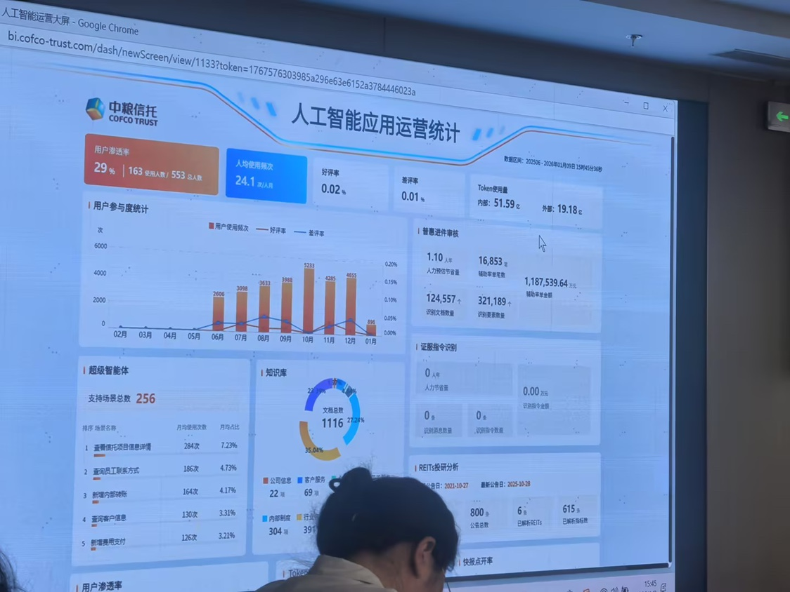

# 需求规格说明书范例 —— 基于原型图

## 1. 简介

本文档基于原型图“[]”，按照 [spec-kit](https://github.com/github/spec-kit) 的规范，梳理产品需求，为后续设计与开发提供明确、详细的参考，实现需求的规范化与可追溯性。适用场景涵盖数据产品、数据看板和运营智能等可视化应用。

---

## 2. 项目背景与目标

- **背景**：将人工智能应用的运营数据进行统计并可视化，供产品与运营决策使用。
- **目标**：提供准确、可追溯且可交互的可视化看板，展示关键运营指标（如用户激活率），支持按时间和维度钻取。

---

## 3. 术语与名词解释

- 用户激活（Activated User）：在统计周期内完成至少一次关键行为（例如登录并使用主功能）的用户。
- 总用户（Total Users）：在统计周期内在系统中存在的去重用户数。
- 激活率（Activation Rate）：激活用户 / 总用户 * 100%（见第4.2节定义）。

---

## 4. 功能需求

### 4.1 主要功能列表

| 编号 | 功能名称   | 描述                                    | 原型图区域 |
| ---- | ---------- | --------------------------------------- | ---------- |
| F-01 | 用户激活率 | 统计并展示总用户数、激活用户数与激活率   | [用户激活率] |
| F-02 | 人均使用频次| 统计并展示人均使用频次  | [人均使用频次] |
| F-03 | 好评率 | 统计并展示好评率  | [好评率] |
| F-04 | 差评率 | 统计并展示差评率  | [差评率] |
| F-05 | token使用量 | 统计并展示token使用量 | [token使用量] |
| F-06 | 用户参与度统计 | 将好评率， 用户使用频次，差评率统计分析并展示  | [用户参与度统计] |
| F-07 | 普惠进件审核 | 统计分析人力预估节省量，辅助审单金额， 辅助审单笔数，识别文献数量等进行展示  | [普惠进件审核] |
| F-08 | 超级智能体 | 统计分析各种场景名称，月均使用次数，月均占比并展示  | [超级智能体] |
| F-09 | 知识库 | 统计分析公司信息，客户服务，内部制度等展示  | [知识库] |
| F-10 | 证服指令识别 | 统计分析人力节省量，识别信息数量，识别指令数量，识别指令金额并展示  | [证服指令识别] |
| F-11 | REITs投研分析 | 统计分析公告指数，已解析指标数等展示  | [REITs投研分析] |

### 4.2 功能详情

#### F-01 用户激活率

- 目的：让产品/运营快速理解用户在指定周期内的活跃和转化情况，支持按日期/产品线/地域等维度筛选。
- 指标定义：
  - 总用户（TotalUsers）：统计周期内去重的用户ID数。
  - 激活用户（ActivatedUsers）：在统计周期内至少完成一次“激活事件”的去重用户数（激活事件需由产品定义，例如首次完成关键动作）。
  - 激活率（ActivationRate）= ActivatedUsers / TotalUsers。
- 数据来源与频率：
  - 数据来源：埋点事件或后端日志（列出负责的事件名称/字段，需由数据团队确认）。
  - 同步频率：每日汇总；支持近实时（10分钟内）近似展示（需数据管道支持）。
- 展示要求：
  1. 面板顶部显示总用户、激活用户、激活率（百分比，保留两位小数）。
  2. 显示折线图/柱状图：按日期展示激活率趋势，支持日/周/月粒度切换。
  3. 支持按渠道/地域/产品线下钻（在图表或表格上点击维度项可查看明细）。
  4. 支持导出当前筛选的数据为 CSV。
- 计算细则与边界条件：
  - 去重规则：以用户ID为主键进行去重；若用户ID缺失，按匿名ID或设备ID回退，但应在数据表中标注回退情况。
  - 分母为0时（TotalUsers=0），激活率应显示为“—”或0%，并在悬浮提示解释原因。
  - 数据延迟与纠错：为避免部分延迟导致波动，支持显示“数据延迟时间戳”并提供近实时与最终数据切换。
- 权限与可见性：仅产品/运营/数据分析角色可查看或导出明细（具体权限由 IAM 配置）。
- 监控与告警：若关键数据（如每日TotalUsers或ActivatedUsers）波动超过阈值（可配置），触发告警通知数据团队。

#### F-02 人均使用频次

- 目的：衡量用户的活跃程度及产品粘性，为优化产品功能和提升用户体验提供数据支撑。
- 指标定义：
  - 人均使用频次 = 总使用次数 / 总用户数。
  - 总使用次数：在统计周期内累计调用主功能的次数。
- 展示要求：
  1. 主视图显示周期内总使用次数、人均频次（保留两位小数）。
  2. 折线图/柱状图展示人均频次的时间趋势。
  3. 支持多维度下钻与明细导出。
- 权限要求：同F-01。

#### F-03 好评率

- 目的：反映用户对产品服务的正面反馈比例，指导产品优化方向。
- 指标定义：好评率 = 好评数 / 评价总数。
- 展示要求：
  1. 主视图显示好评数、总评价数、好评率（百分比格式）。
  2. 折线/饼图展示好评率趋势及分布。
  3. 支持下钻查看各渠道/区域好评明细。
- 特别说明：需定义何种行为/反馈计为“好评”，如五星评价、主动点赞等。

#### F-04 差评率

- 目的：快速定位负面反馈、监控服��问题。
- 指标定义：差评率 = 差评数 / 评价总数。
- 展示要求和边界条件同F-03，内容为负面评价。

#### F-05 token使用量

- 目的：跟踪AI相关token的消费与成本，辅助运营决策。
- 指标定义：统计周期内所有AI模型调用消耗的token总和。
- 展示要求：
  1. 面板显示token总使用量、��模型/应用拆分的token用量。
  2. 支持趋势图和明细导出。
  3. 提供单位说明（如1K token等价，相关费用等）。

#### F-06 用户参与度统计

- 目的：综合反映用户使用积极性，包括好评率、使用频次、差评率等多维度。
- 指标定义与展示要求：
  - 数据以多维雷达图或综合评分面板展现，支持细分用户群和定制筛选。

#### F-07 普惠进件审核

- 目的：统计普惠自动化投审流程中的人工节省、辅助金额与文献识别效率。
- 指标定义：
  - 统计周期内预估节省人力量（工时/人数），辅助审单总金额（元）、辅助审单笔数、识别文献数量等。
- 数据来源：业务系统审单日志，文档识别流水。
- 展示要求：面板主显核心指标，按时间/地区/产品线下钻分析。
- 权限与导出：仅审核、运营、管理授权用户可查看明细与导出。

#### F-08 超级智能体

- 目的：统计AI超级智能体（如对话机器人、流程自动化等）在各业务场景的应用效果。
- 指标定义：
  - 不同场景名称及对应用户数，月均使用次数、月均场景占比等。
- 数据来源：智能体服务调用日志，场景配置表。
- 展示要求：看板支持切换场景统计，维度横向对比。

#### F-09 知识库

- 目的：统计知识库应用在公司信息、客户服务、内部合规等方面的支撑效果。
- 指标定义：
  - 文档数、 faq/知识点覆盖量、服务响应次数等。
- 数据来源：知识库系统推送、客户服务平台接口。
- 展示要求：维度分布及趋势变化，主指标一览。

#### F-10 证服指令识别

- 目的：分析自动化指令解析在证服业务中的效用。
- 指标定义：
  - 识别和处理的指令总数、人力节省量（时长/金额）、识别信息数量和涉及金额。
- 数据来源：指令服务日志、人工备案数据。
- 展示要求：按业务类别统计，趋势/明细可导出。

#### F-11 REITs投研分析

- 目的：反映投研自动化在REITs公告、指标分析的支持。
- 指标定义：
  - 公告解析总数，已解析重点指标数量，投研决策辅助次数等。
- 数据来源：公告抓取与解析流水、系统分析日志。
- 展示要求：不同基金产品可对比，主指标及趋势可导出。

---

## 5. 非功能需求

- 响应速度：面板主视图在正常网络下交互响应（首屏渲染）在 300ms 内完成；图表交互（切换维度）应在 500ms 内完成。
- 兼容性：兼容主流 Chrome、Edge、Safari 最新版及桌面分辨率范围（1024x768 及以上）。
- 可观测性：前端需埋点关键操作以便定位性能或数据问题；后端需记录数据处理时延与错误率日志。
- 可拓展性：系统架构应支持指标项动态扩展和接入新的数据源。
- 安全性：敏感数据按最小权限原则控制访问，并支持数据访问操作审计。
- 可维护性：文档和配置应同步与系统迭代，支持一键全量重算和历史修订回溯。
- 可用性：系统应具备基础高可用保障，重大或持续异常时支持降级和错误提示。

---

## 6. 交互与视觉（IxD/UI）

- 交互流程：按原型图建立点击流和页面跳转关系，保持面板与图表的交互一致性（过滤器在顶栏，图表支持悬浮显示详情）。
- 视觉指南：参照原型配色、字体、间距等，数值类信息（如激活率）使用明确的色彩与单位（%）；异常值用警示色标注。
- 图标及图片规范：按项目 UI 库执行，SVG 优先，图表导出为 PNG/SVG。
- 无障碍支持：主流可视化组件应提供高对比配色及键盘操作支持，满足基本无障碍需求。

---

## 7. 验收标准

- 核心功能：总用户、激活用户与激活率数值正确显示且与数据源一致（抽样校验通过）。
- 交互流程：按原型完成筛选、下钻与导出功能，异常与边界场景展示符合说明。
- 性能：常用视图在规定响应时间内完成渲染。
- 权限：仅授权角色可访问导出与明细数据。
- 可维护性：配置、字段与运行日志应完整、可追溯，支持后续问题定位与修订。

---

## 8. 依赖与假设

- 依赖数据团队提供稳定的埋点事件及每日汇总表，包含用户ID、事件时间、渠道/地域/产品线字段。
- 假设：用户ID在大部分场景下可用；若不可用，需要明确回退方案并记录精度损失。
- 依赖 IAM/权限系统完成角色配置以限制数据导出权限。
- 依赖产品原型和业务团队对各模块数据口径及分析需求的确认与补充。

---

## 9. 参考资料

- spec-kit 规范参考：https://github.com/github/spec-kit
- 原型图（见仓库中的资源文件）

---

## 10. 开放问题

1. 激活事件的精确定义（哪些行为计为“激活”）需要产品与数据团队最终确认；
2. 是否必须支持近实时（10分钟级）数据展示，若支持，需要数据管道确认 SLA；
3. 导出权限的具体角色名单与审计要求由安全/合规方确认。
4. F-07~F-11详细指标及口径，需要业务团队后二次评审与补充说明。

---

(变更记录：在原稿基础上补充了“术语解释”、F-01 的详细指标定义、数据来源、计算细则、展示与权限要求，新增“依赖与假设”与“开放问题”章节，完善了非功能和验收标准。2026年1月13日 by speckit.)
